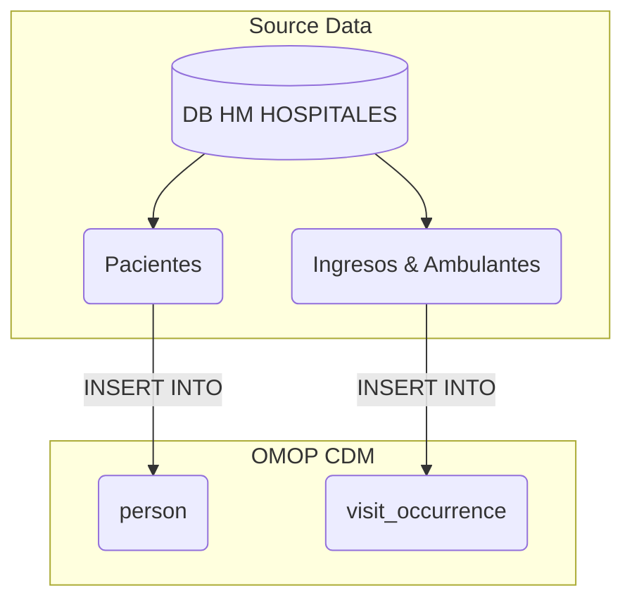

```mermaid
flowchart TD
    db[(DB HM HOSPITALES)]
    subgraph Source Data 
    db --> pac(Pacientes)
    db --> episodios(Ingresos & Ambulantes)
    end

subgraph OMOP CDM
    pac --> |INSERT INTO| person(person)
    episodios --> |INSERT INTO| visit_occ(visit_occurrence)
end
```
