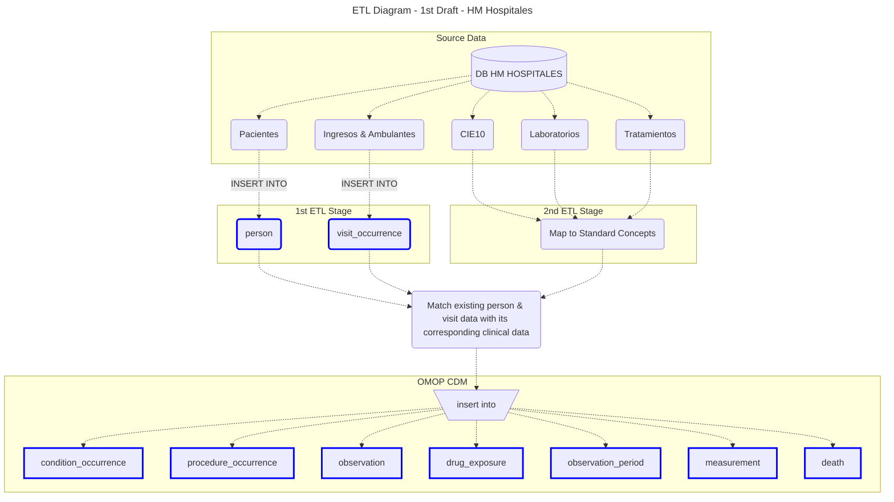

```mermaid
---
title: ETL Diagram - 1st Draft - HM Hospitales
---
flowchart TD
    db[(DB HM HOSPITALES)]
    subgraph Source Data 
    db -.-> pac(Pacientes)
    db -.-> episodios(Ingresos & Ambulantes)
    db -.-> cie(CIE10)
    db -.-> trat(Tratamientos)
    db -.-> lab(Laboratorios)
    end

subgraph 2nd ETL Stage
    cie & lab & trat -.-> map(Map to Standard Concepts)
end

subgraph 1st ETL Stage
    pac -.-> |INSERT INTO| person(person)
    episodios -.-> |INSERT INTO| visit_occ(visit_occurrence)
    style person fill:#,stroke:#00f,stroke-width:3px
    style visit_occ fill:#,stroke:#00f,stroke-width:3px
end

person & visit_occ & map -.-> match(Match existing person & visit data with its corresponding clinical data)

match -.-> insert[\insert into/]

subgraph OMOP CDM
insert -.-> condition_occurrence & procedure_occurrence & observation & drug_exposure & observation_period & measurement & death
    style condition_occurrence fill:#,stroke:#00f,stroke-width:3px
    style procedure_occurrence fill:#,stroke:#00f,stroke-width:3px
    style observation fill:#,stroke:#00f,stroke-width:3px
    style observation_period fill:#,stroke:#00f,stroke-width:3px
    style drug_exposure fill:#,stroke:#00f,stroke-width:3px
    style measurement fill:#,stroke:#00f,stroke-width:3px
    style death fill:#,stroke:#00f,stroke-width:3px
end
```
